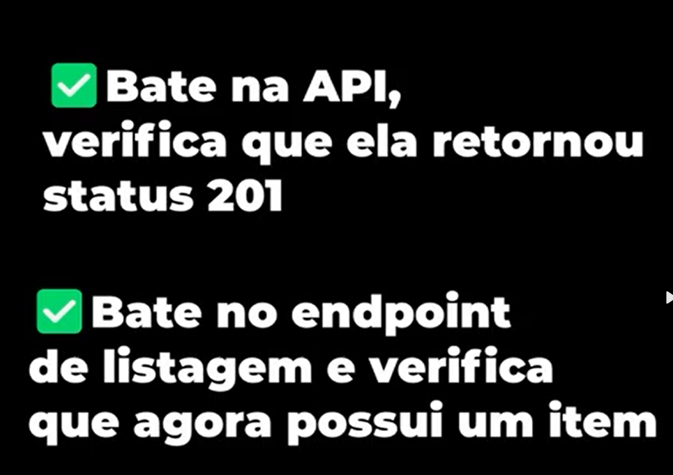

# Metodo-TAJS
Estudo sobre implementacao de Testes Automatizados a fim de aumentar a capacidade de construir testes mehores e ais confiaveis
Metrica para producao de aplicacao

1-"Nao tocar no codigo enquanto voce nao estiver  100% satisfeito que entendeu o problema e o passo a passo para a solucao" 
Entrada -> Processamento -> Saida
2-"Valide oq vc fez de maneira automatizada"
3-"Pepare o setup ferramental , testing e debugging enquanto programe"

Nao apliacado no dia a dia em todos os casos

## Teste de Integracao :

    Exemplo : Verifica as web APIS  

    React:

## Test END-to-END
    Simular o usuario 

Frontend

## Testes unitarios
    Voce parte do principio que as APIS estao funcionando corretamente.
    

