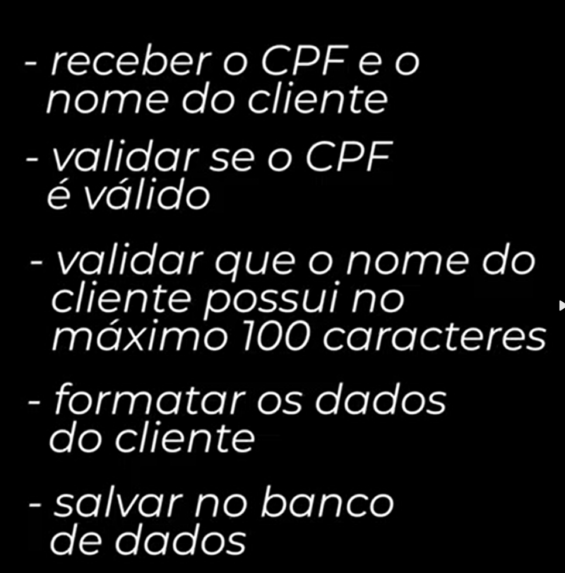

*Stubs* : simula conexoes externas
*Spies*: Inpecionar quantas vezes uma funcao foi chamada assim como se 
foram chamadas corretamente

-Com mocks no caso de arquivos , voce ganha a liberdade de analisar se 
como , por exemplo , a sua aplicacao de comportaria caso nao houvesse espaco em disco, como lidar com isso...

QUANDO E O MELHOR MOMENTO PARA USAR MOCKS ? 
-QUANDO VC PAGA POR USO OU ESCRITAS DE BANCO DE DADOS 
-QUANDO E NECESSARIO CHAMAR MAIS DE 1 API AO MESMO TEMPO

*FakeTimers*: simular como o tempo ta passando por esse tempo sem passar esse tempo 

*Code Coverage*: o quao seus testes cobrem suas funcoes
 *Statements* -> funcoes
 *Branhs*-> ifsc