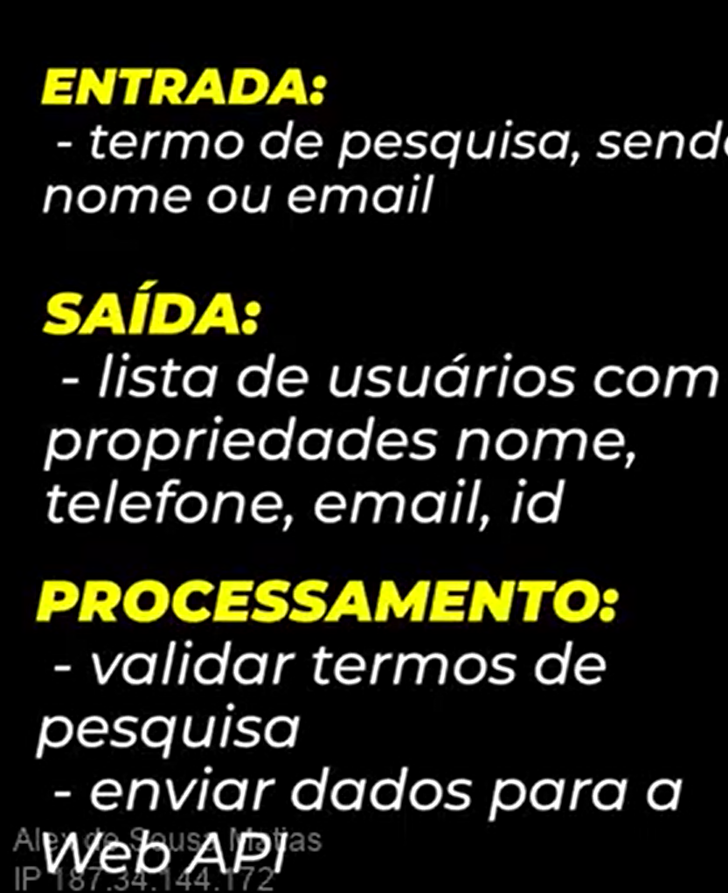

Pilares Metodo TAJS:
1-"Nao tocar no codigo enquanto nao tiver 100% satisfeito que entendeu o problema e o passo a passo
para a solucao"-> Entrada , processamento , saida ( para cada funcao)
2-Valide o que voce entregou de forma automatizada
3-Prepare o setup ferramental (debugging & tests) 

*Metodo TDD*

Exemplo consulta de dados de usuarios:

Agora prepara o setup ferramental, com debugging e tests.
E entao voce prepara a implementacao com os AAA ( arrange, act and acert). 
E ai comeca a implementar as funcoes que deseja, vendo as saidas e entradas com o debugging.
Dessa forma nao e necessario sair do seu campo de codigo para verificar as chamadas e outras coisas.
Por exemplo sair para ver no postman.
TDD parte de um principio de ciclos , a sua funcionalidade deve ser construida com a aplicacao.